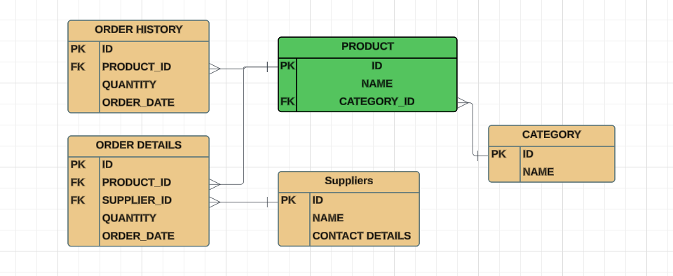
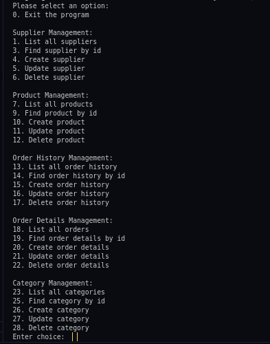

# Inventory Management System

This Inventory Management System (IMS) is a Python-based command-line application that helps manage products, suppliers, orders, and categories for a business.

## Features

- **Supplier Management:** Add, update, delete, and search for suppliers.
- **Product Management:** Add, update, delete, and search for products. Assign products to categories.
- **Order History Management:** Track the history of orders including product, quantity, and order date.
- **Order Details Management:** Track the details of each order, including product, supplier, quantity, and order date.
- **Category Management:** Add, update, delete, and search for product categories.

## ERD Diagram
Entity-Relational Diagram (ERD) that shows the relationships between different records from diffrent tables:



## Command-line interface (CLI) 

Once the user enters the terminal, there is a user-frienly CLI as shown below:



## Installation


1. Get a free API Key at:
```
https://github.com/Bjoseph23/bidhaa-system-ims 
```
2.Clone the repo
```
git clone https://github.com/your_username/bidhaa-system-ims
```
3.And Lastly in the terminal, install relevent files with:
```
 pipenv install
 pipenv install sqlalchemy alembic
 ```

## Setup

After installation, run this command in your terminal to get cli running :

```
python cli.py
```

## Technologies used
1.Python    
2.SqlAlchemy

## Installation Requirements
Git


## Licenses
MIT License

Copyright (c)  BILL MAGENI 2024

Permission is hereby granted, free of charge, to any person obtaining a copy
of this software and associated documentation files (the "Software"), to deal
in the Software without restriction, including without limitation the rights
to use, copy, modify, merge, publish, distribute, sublicense, and/or sell
copies of the Software, and to permit persons to whom the Software is
furnished to do so, subject to the following conditions:

The above copyright notice and this permission notice shall be included in all
copies or substantial portions of the Software.

THE SOFTWARE IS PROVIDED "AS IS", WITHOUT WARRANTY OF ANY KIND, EXPRESS OR
IMPLIED, INCLUDING BUT NOT LIMITED TO THE WARRANTIES OF MERCHANTABILITY,
FITNESS FOR A PARTICULAR PURPOSE AND NONINFRINGEMENT. IN NO EVENT SHALL THE
AUTHORS OR COPYRIGHT HOLDERS BE LIABLE FOR ANY CLAIM, DAMAGES OR OTHER
LIABILITY, WHETHER IN AN ACTION OF CONTRACT, TORT OR OTHERWISE, ARISING FROM,
OUT OF OR IN CONNECTION WITH THE SOFTWARE OR THE USE OR OTHER DEALINGS IN THE
SOFTWARE.
